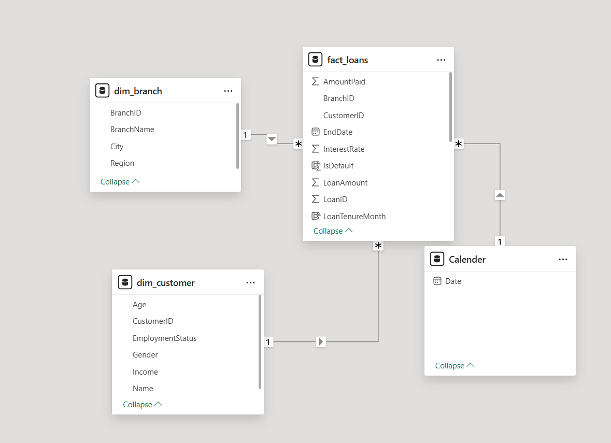

# Project Overview
 ### Project Title:
Loan Performance & Customer Segmentation Dashboard

### Objective:
To analyze loan performance metrics across branches and customer demographics, and to identify actionable customer segments for improved risk profiling and targeted product strategies.

### Goals:
1. Assess the health of the loan portfolio

2. Evaluate repayment behavior and outstanding balances

3. Analyze loan performance by region, branch, and customer attributes

4. Identify patterns in defaulted or underperforming loans

5. Segment customers based on income, age, and employment status for marketing and risk analysis

### Business Value:
This project enables decision-makers in financial institutions to:

1. Enhance loan product offerings based on performance trends

2. Target high-value and low-risk customer segments

3. Detect risky borrowers early for preventive actions

4. Monitor branch- and region-level performance efficiently

5. Optimize strategies for marketing, risk management, and loan recovery

### Business Questions
 Loan Performance
1. What is the total loan amount disbursed, repaid, and outstanding?
   
2. What percentage of loans are active, defaulted, or fully paid?

3. How does loan performance differ across regions and branches?

 Customer Demographics
1. What is the distribution of borrowers by age, gender, and employment status?

2. How does income level relate to loan performance and default rates?

3. Are certain age groups more likely to default?

 Branch-Level Insights
1. Which branches have the highest outstanding balances or default rates?

2. How do average interest rates vary across branches or regions?

 Loan Segmentation
1. What characteristics (age, income, employment status) are associated with:

   Fully repaid loans?

   Defaulted loans?

## Exploratory Data Analysis(EDA) and Data Cleaning 
 The data cleaning include: check structure, removed duplicates, and handled missing values.
 
 The Exploratory Data Analysis(EDA) includes

    

   

 #### Key insights
 1. Paid Loans Dominate: The most frequent status is "Paid", indicating a relatively strong repayment culture or successful underwriting processes. This is a good sign for overall loan portfolio health.
 2. Significant Approved Loans: A high number of loans are in the "Approved" category. This suggests an active pipeline and potential for future earnings, but also underlines the importance of close monitoring to ensure conversion to repayment.
 3. Default Rate Noticeable: The "Defaulted" loans, although smaller in count, are significant enough to warrant attention. This group presents a clear risk and should be examined for shared traits (e.g., demographics, income level, loan size).
 4. In Progress Loans: The mid-sized bar for "In Progress" shows an active set of loans currently in repayment or early stages. Timely engagement and support could reduce the chance of future defaults.

     

#### Key insights:
 1. There is no clear linear relationship between age and outstanding balance, indicating that loan balances are distributed fairly evenly across different age groups.
 2. Defaulted and In Progress loans are widespread across all ages, but slightly concentrated among the 25 to 50 age range, indicating higher financial activity or risk within this demographic.
 3. Approved loans also appear across the board, but many still show relatively high outstanding balances suggesting early-stage repayment or potential risk zones.

     

#### Key insights:
 1. Both genders show similar patterns in loan status distributions.
 2. Slightly more females than males have fully paid their loans.
 3. Default rates are comparable, though slightly higher in males, suggesting a potential area for gender-focused risk assessment.
 4. The number of approved and in-progress loans are relatively similar across genders, indicating fair approval practices and engagement.

    

 #### Key insights:

 1. Loan Size is Fairly Evenly Distributed: The histogram indicates a fairly uniform distribution of loan amounts, with most loans clustering between 10,000 and 45,000 units.
 2. Mild Peaks at Mid Ranges: There's a slight increase in loans around 30,000–35,000, indicating borrower preference or eligibility for mid-sized loans.
 3. Low Volume at Extremes: Fewer loans are issued below 10,000 or above 45,000, which could be due to policy constraints or fewer applicants needing amounts at those ranges.

   
For full data exploration and cleaning steps, see the [Data Exploration & Cleaning Notebook](notebooks/data_exploration_cleaning.ipynb).

## Data Transformation(ETL)
  Data extracted, transformed and loaded into Power BI for modeling and visualiaztion.
  

## Power BI 
 ### Data Modelling
 

### Dataset Overview
The analysis is based on a star schema consisting of the following tables:

1. fact_loan: Core transactional data for loans (Loan ID, Customer ID, Loan Amount, Term, Start/End Dates, Payment Status).

2. dim_customer: Contains customer demographic and financial attributes (Age, Gender, Income, Employment Status).

3. dim_branch: Provides metadata about loan branches (City, Region).

4. date_table: Supports time-based analysis.

### Report view 
   #### overview

 
 

#### Key insights:
1. Roughly 45% of the total loan amount has been repaid, while 43% remains outstanding.
2. The Approved segment holds a significant share, representing potential future income. Defaulted amount is lower but non-negligible.
3. Loan volume grew steadily, peaked, and then significantly dropped in 2025, suggesting reduced demand, stricter lending policies, or operational issues.
4. Loan amounts are fairly distributed, but regional focus is clear.
5. Wisconsin has the highest outstanding, implying higher risk exposure if defaults increase.
  

 #### Customer Segmentation and Risk

    

   

     
#### Regional Performance Analysis

    

 

### CALCULATED COLUMNS & MEASURES
   #### Calculated Columns (Power BI DAX)
   
1. Loan Tenure (Months)
  LoanTenureMonths = DATEDIFF(fact_loan[StartDate], fact_loan[EndDate], MONTH)

2. Payment Ratio
   PaymentRatio = DIVIDE(fact_loan[AmountPaid], fact_loan[LoanAmount])

3. IsDefault = IF(fact_loan[Status] = "Defaulted", 1, 0)

  ####  DAX Measures
1. Total Loans
   TotalLoans = COUNT(fact_loan[LoanID])

2. Total Loan Amount
   TotalLoanAmount = SUM(fact_loan[LoanAmount])

3. Outstanding Balance
   TotalOutstanding = SUM(fact_loan[OutstandingBalance])

4. Average Interest Rate 
   AverageInterestRate = AVERAGE(fact_loan[InterestRate])

5. Default Rate
   DefaultRate = DIVIDE(SUM(fact_loan[IsDefault]), COUNT(fact_loan[LoanID]))
